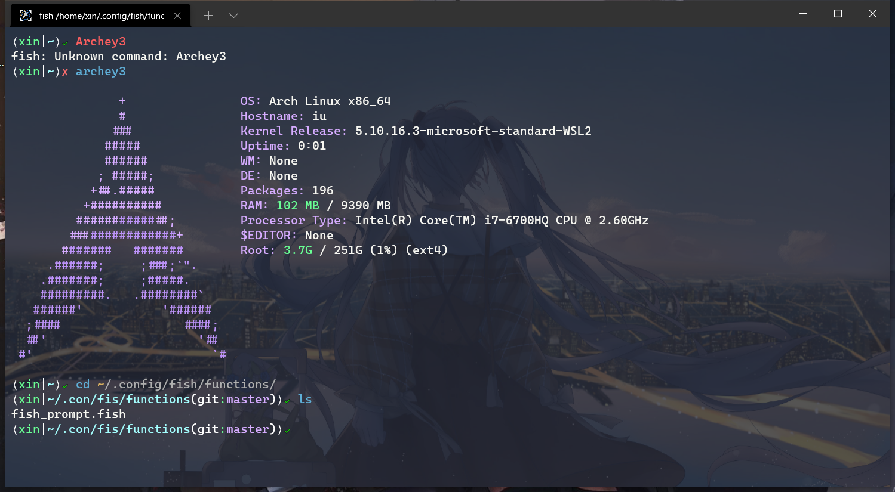

# Dirac prompt for [Fish](https://fishshell.com/)
> A bra-ket (Dirac Notation) like prompt for [friendly interactive shell](https://github.com/fish-shell/fish-shell)


## Dirac Notation
>  [From Wikipedia](https://en.wikipedia.org/wiki/Bra%E2%80%93ket_notation), the free encyclopedia

In quantum mechanics, bra–ket notation, or Dirac notation, is used ubiquitously to denote quantum states. The notation uses angle brackets, ${\displaystyle \langle }\langle$  and ${\displaystyle \rangle }\rangle$ , and a vertical bar ${\displaystyle |}|$, to construct "bras" and "kets".

## Installation
Download using the GitHub .zip download or use git.
```bash
git clone https://github.com/zipeilee/DiracFishPrompt.git 
```
Then place `fish_prompt.fish` in your ~/.config/fish/functions/ directory, then reload fish e.g. `exec fish`.